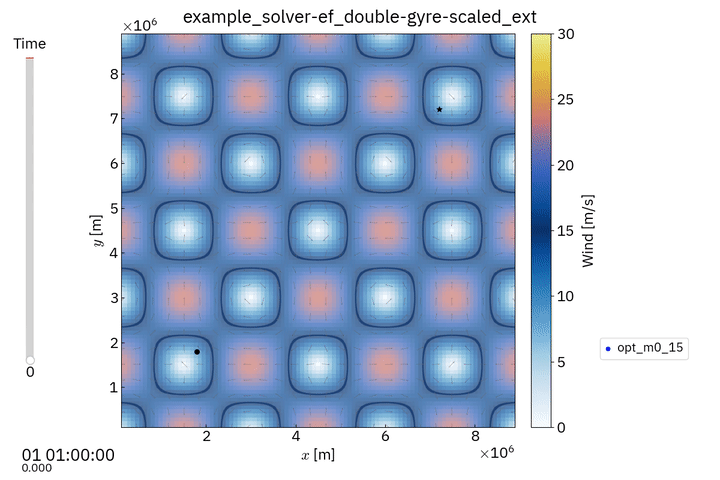
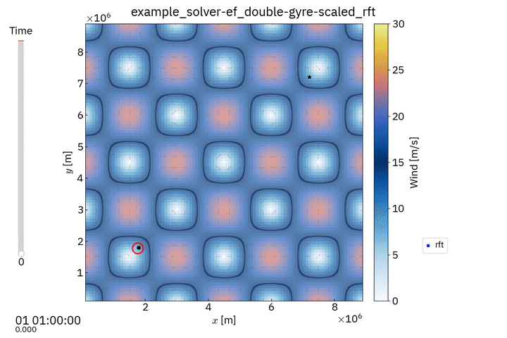

# Trajectory planning visualization tool

## Description

This tool is a companion to the [Dabry module](<https://github.com/bschnitzler/dabry>).

It handles the visualisation of trajectory optimization problems 
and the different objects at stake:
- Individual trajectories
- Wind fields
- Extremal fields
- Reachability fronts

It can handle time-varying winds, 2D planar as well as spherical (Earth)
problems.

## Installation

Follow the instructions for the Dabry module.
You should now have a working directory with structure:
```
wdir
└── dabry
└── env
```

`cd` into this working directory and clone the dabryvisu repo 
```sh
git clone [repo-url]
```

Then activate your environment 
```sh
source env/bin/activate
```

Install `dabryvisu` 
```sh
pip install ./dabry-visu
``` 

The variable `DABRYPATH` shall point to the cloned `dabry` repository.
This is the case if you followed Dabry's installation instructions.

## Running the tool

Common way to run the tool is
```sh
python -m dabryvisu
```

To run the visualization of the latest case, use

```sh
python -m dabryvisu -l
```

To create an animation from a case, use

```sh
python -m dabryvisu -m
```

To see all options, print help

```sh
python -m dabryvisu -h
```

## Examples

Here are some previews of the tool

- Resolution with extremal field



- Resolution with front tracking (interface to [ToolboxLS](https://www.cs.ubc.ca/~mitchell/ToolboxLS))



More examples can be found on the dedicated [website](https://dabry-navigation.github.io).

